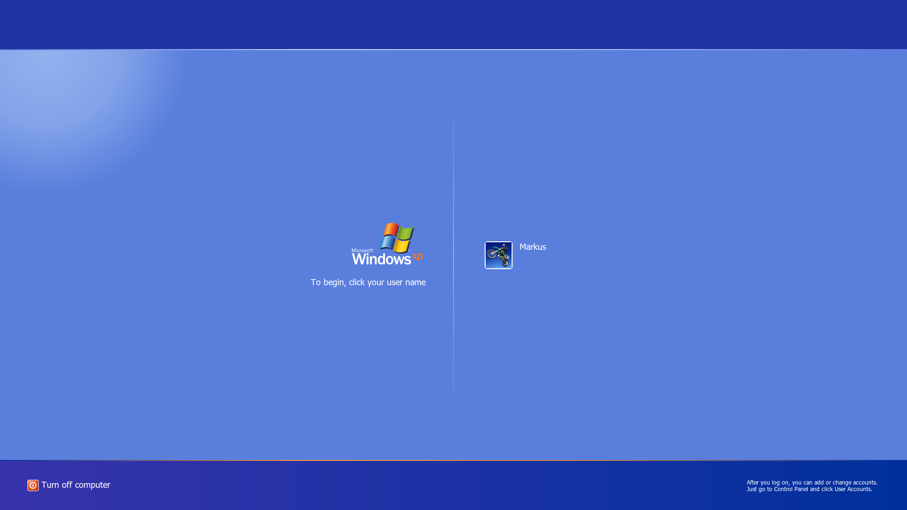
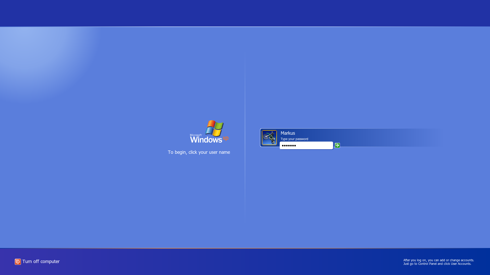
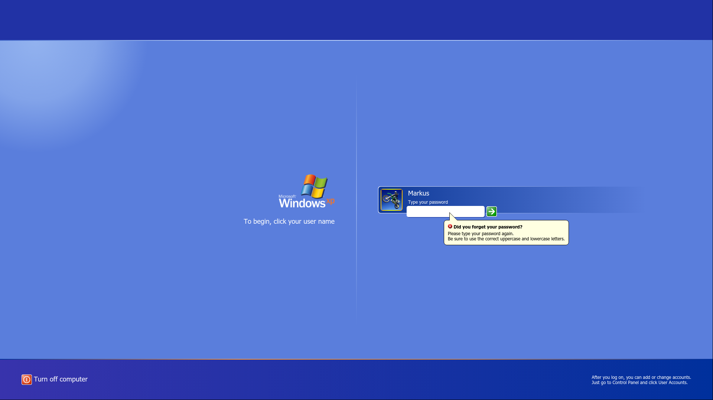
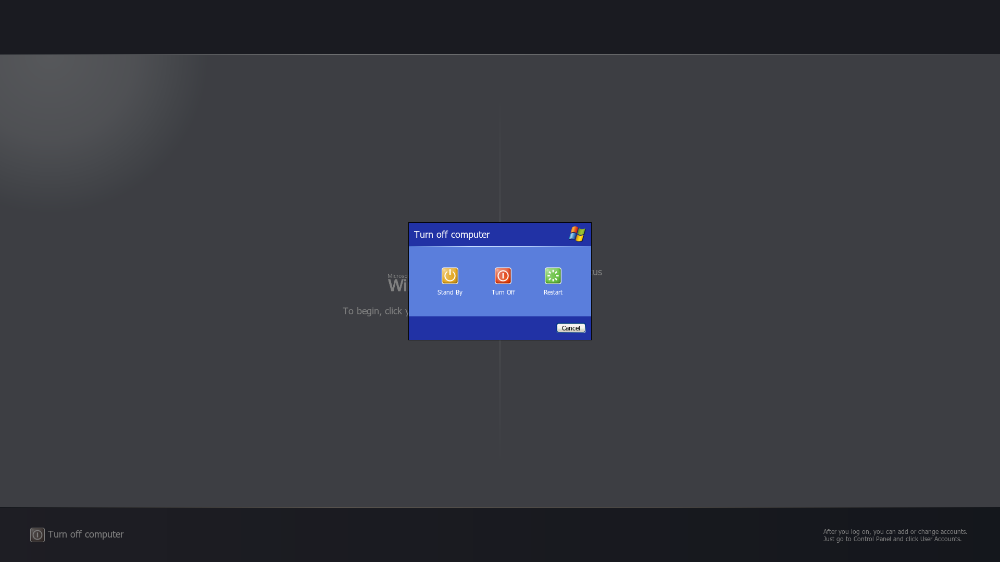
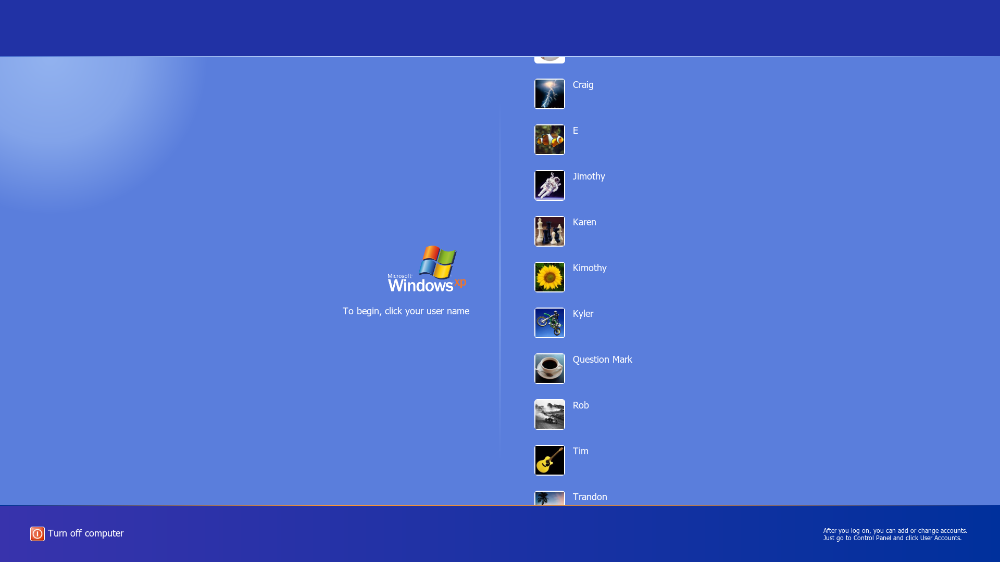
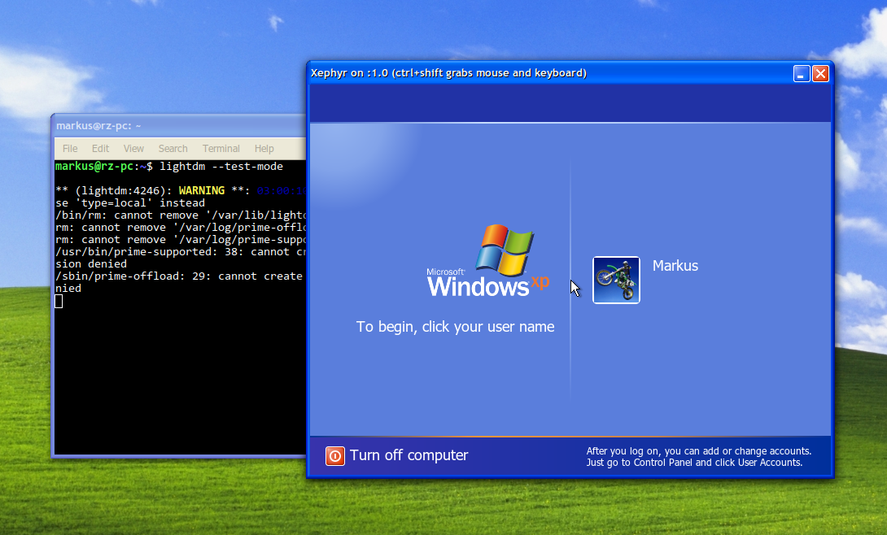

# WelcomeXP
A lightdm-webkit2-greeter to mimic the Windows XP login screen.

There is a [*really great Windows XP theme for Cinnamon*](https://github.com/ndwarshuis/CinnXP) which I've been using practically since it existed (thanks, @ndwarshuis).

I found that there seems to be no recent attempts to make a greeter to match it, which is where this project began.

With the help of the lightdm-webkit2-greeter engine, this theme makes an attempt at recreating the XP login screen.

The lightdm-webkit2-greeter engine has a few inconsistencies with regular browsers (especially for flex layout) but for the most part you can get a general idea of how the screen will look simply by cloning the project and viewing `index.html` in a standard browser. Things aren't perfect yet, but they come decently close to the real thing. Take a look at the screenshots below, captured from a virtual machine with this theme in actual use:

# Screenshots
Login:

Selected User:

Incorrect Password:

Welcome Screen:

Shutdown Options:

Multiple Users:

# Warnings
If you have no experience installing or configuring `lightdm-webkit2-greeter` then I recommend you have extreme caution installing this theme and avoid it if you are not comfortable with the possibility of recovering your login screen from the command line. While I do not currently have any severe issues using the theme on a daily basis myself, I will continue to make small changes that could affect stability in the future. A broken lightdm theme can prevent you from logging in graphically. In this case, you can switch to another tty and revert changes to the configurations using an editor like `nano`. While I do not plan to push breaking changes, I do not make any guarantees over this project and would not want someone to break their system who would have a hard time restoring it.

# Important Notes
*Please be aware of the following:*
* The theme does ***not*** support choosing a desktop environment within the login screen; you will need to make sure to customize `index.theme` to the one you need.
* If you do not have a user profile picture set, the default is the Windows XP dirt bike profile picture.
* There is no option to manually enter a username. If you have users which are hidden from the user list used by lightdm then you will not be able to access that account from this login screen.

# Installation
1) Install the `lightdm-webkit2-greeter` package and set `greeter-session=lightdm-webkit2-greeter` in your lightdm configuration.
2) Clone the `WelcomeXP` project into its own folder.
3) Edit the `index.theme` in the project folder and ensure that the `session=` matches your desktop environment. By default, the login screen will attempt to launch `cinnamon`.
4) *OPTIONAL, BUT RECOMMENDED* Create a `fonts` directory in the `WelcomeXP` folder and place copies of `tahoma.ttf`, `tahomabd.ttf`, and `framd.ttf` into the new directory for a more authentic login screen. If you have a Windows installation, you can easily grab them from `C:\Windows\Fonts`.
5) Copy the `WelcomeXP` folder into the `themes` directory for the webkit greeter, ex. `sudo cp -R WelcomeXP /usr/share/lightdm-webkit/themes`.
6) Ensure that the theme folder has adequate permissions for the system to read the necessary files, ex. `sudo chmod -R 755 /usr/share/lightdm-webkit/themes/WelcomeXP`.
7) Modify `lightdm-webkit2-greeter.conf` and set the `webkit_theme = WelcomeXP`.
8) Run `lightdm --test-mode` to ensure that the theme was installed correctly. If the theme appears in a small window without errors, there is likely no issue. If you see a pop-up warning that the theme has errors, then there is some issue with either the theme or installation and you may want to revert your changes before rebooting or logging out. As a side note, I would not recommend letting `lightdm --test-mode` capture your keyboard/mouse input as this has always caused issues for me when testing any theme where it will freeze up (without releasing the mouse or keyboard).
9) Enjoy the theme! If you want to install an updated version, you can remove the older version of the theme, ex. `sudo rm -rf /usr/share/lightdm-webkit/themes/WelcomeXP`, then redo steps 2-7 skipping configuration changes that were already done. Always make sure to test the theme on step 7 so you don't run into any unexpected issues.

Example of a successful run of `lightdm --test-mode`:

