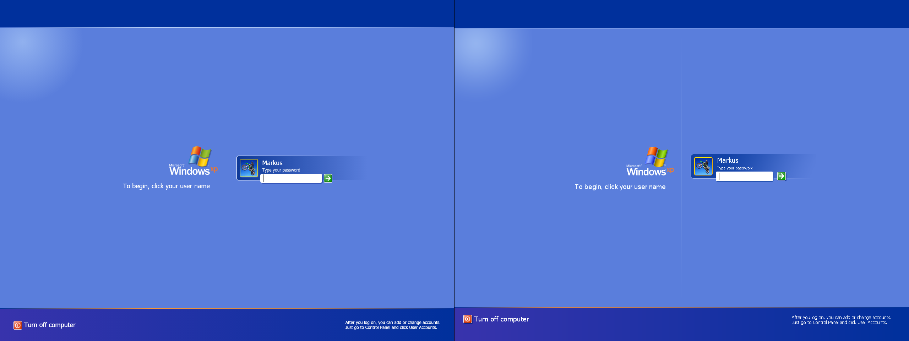
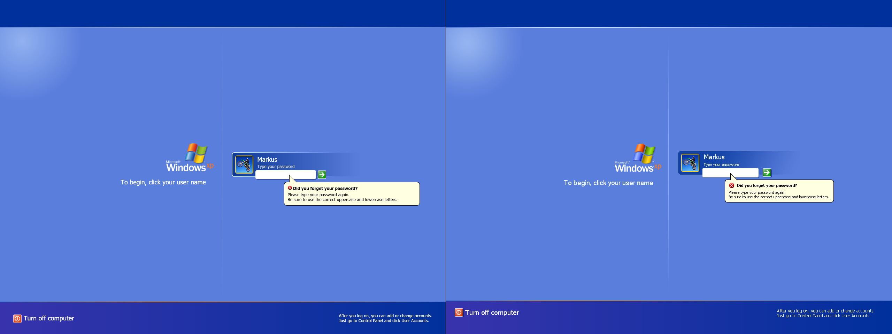
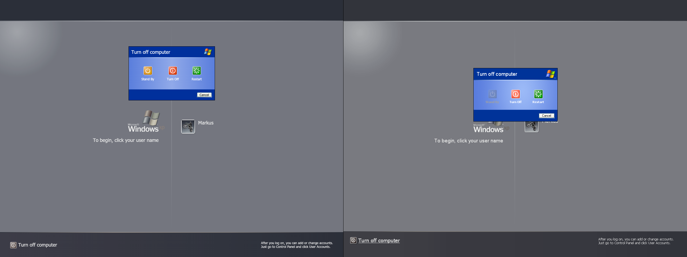
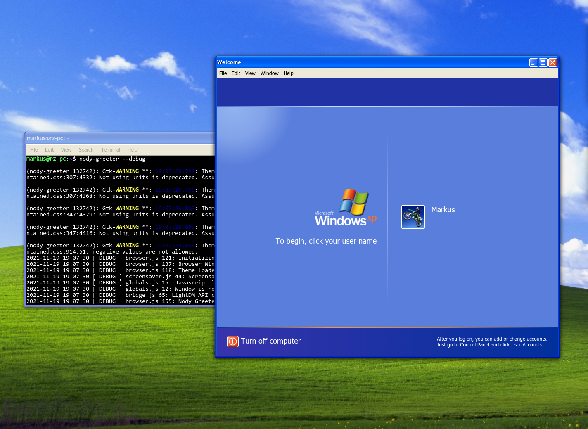

# WelcomeXP
A nody-greeter theme to mimic the Windows XP login screen.

There is a [*really great Windows XP theme for Cinnamon*](https://github.com/ndwarshuis/CinnXP) which I've been using practically since it existed (thanks, [@ndwarshuis](https://github.com/ndwarshuis)).

I found that there seems to be no recent attempts to make a greeter to match it, which is where this project began.

# Screenshots
You can get a good idea of how the screen will look simply by cloning the project and viewing `index.html` in a standard browser. Things aren't perfect yet, but they come decently close to the real thing.

Take a look at the screenshots below, captured from a virtual machine with this theme in actual use:

Login:

Welcome Screen:

WelcomeXP vs Original Windows XP Login Screen:

# Notice: Migration To [nody-greeter](https://github.com/JezerM/nody-greeter)
As you may know, [lightdm-webkit2-greeter](https://github.com/Antergos/web-greeter) was maintained by the Antergos team which fell apart years ago.
Unfortunately, this left us in a situation where lots of themes (this one included) were reliant on an unmaintained package; if anything were to break as the software around it updates, we'd all be out of luck.

Fortunately, [@JezerM](https://github.com/JezerM) revived work on the project in the form of [web-greeter 3.0](https://github.com/JezerM/web-greeter).

Even better, they began work on a new project which creates a more modern substitute to the aging lightdm-webkit2-greeter using Node.js and Electron: [nody-greeter](https://github.com/JezerM/nody-greeter).

WelcomeXP has migrated to supporting these projects instead of lightdm-webkit2-greeter.

While themes for nody-greeter and web-greeter 3.0 should work with either interchangeably, moving to work with them will render WelcomeXP incompatible with lightdm-webkit2-greeter. Unfortunately for those who installed this theme previously, this means any future updates will not be as straightforward and will require switching to one of the new greeters.

If you currently have lightdm-webkit2-greeter and do not wish to install any replacements, you can download version [v0.2.1](https://github.com/mshernandez5/WelcomeXP/releases/tag/v0.2.1) which will be the last to work with the old greeter.

# Warnings
If you have no experience installing or configuring greeters then I recommend you have extreme caution installing this theme; avoid it if you are not comfortable with the possibility of recovering your login screen from the command line. While I have not come across any severe issues using the theme on a daily basis myself, I may continue to make small changes that could affect stability in the future. A broken web-greeter theme can prevent you from logging in graphically. In this case, you can switch to another tty and revert changes to the configurations from the command-line using an editor like `nano`. While I do not plan to push breaking changes, I do not make any guarantees over this project and would not want someone to break their system who would have a hard time restoring it.

# Important Notes
*Please be aware of the following:*
* The theme does ***not*** support choosing a desktop environment within the login screen; you will need to make sure the default user-session selected by lightdm is fine. Generally this should not be a problem unless you have multiple desktop environments you like to switch between.
* There is currently no option to manually enter a username. If you have users which are hidden from the list given to lightdm then you will not be able to access that account from this login screen.
* If you do not have a user profile picture set, the default is the Windows XP dirt bike profile picture. If you want to change this, most desktop environments will have an option to add a custom picture to your account under a group of settings generally named "Users" or similar.

# nody-greeter Installation
Please check out the [`nody-greeter`](https://github.com/JezerM/nody-greeter) repository for the most detailed and up-to-date installation instructions.

The following instructions are a quick (and possibly outdated by the time you read this) summary of the installation procedure for Ubuntu-based distributions:

1) Make sure you have any necessary dependencies. Obviously you'll need `lightdm` (which is default on some distributions such as Linux Mint). You will also need `python3`, which is included by default with many (but not all) distributions. You can aquire the other required packages via `sudo apt install build-essential libgirepository1.0-dev liblightdm-gobject-1-0 liblightdm-gobject-1-dev libcairo2-dev`
2) Install Node.js v16.x with help from [this page](https://github.com/nodesource/distributions).
3) Clone the `nody-greeter` project into its own folder, ex. `git clone https://github.com/JezerM/nody-greeter.git`
4) Set the current directory to the newly created folder, ex. `cd nody-greeter`
5) It is generally safest to choose a version instead of using the latest code by running `git checkout 1.4.1`, for example. Check the repository for the latest version.
6) Run `npm install` to fetch dependencies.
7) Run `npm run rebuild`
8) Run `npm run build`
9) Run `sudo node make install` to install the built project.

# WelcomeXP Installation
1) Add `X-LightDM-Allow-Greeter=true` to your `/usr/share/xsessions/` desktop file then log out and back in. This is not necessary for installation but is necessary to test whether the installation was successful. This cannot be done later on since it requires you to log out and back in which defeats the purpose of testing whether the login screen works before trying to use it.
2) Install `nody-greeter` and set `greeter-session=nody-greeter` in your lightdm configuration. You may choose to install [`web-greeter`](https://github.com/JezerM/web-greeter) instead assuming you modify these steps accordingly.
3) If your distribution did not originally come with LightDM you must set a default user session corresponding to an option available in `/usr/share/xsessions`. For example, on Lubuntu I can select `/usr/share/xsessions/Lubuntu.session` as the default by adding `user-session=Lubuntu` to the lightdm configuration. Most distributions with LightDM as the default display manager (such as Linux Mint Cinnamon) should already have this preconfigured.
4) Clone the `WelcomeXP` project into its own folder, ex. `git clone https://github.com/mshernandez5/WelcomeXP.git`\
Just in case the very latest code is broken, you may also want to move back to the last release version by doing `git checkout v0.3.1` within the newly created WelcomeXP directory. If you see very recent commits they might not have been extensively tested yet.
5) *OPTIONAL, BUT RECOMMENDED* Create a `fonts` directory in the `WelcomeXP` folder and place copies of `tahoma.ttf`, `tahomabd.ttf`, and `FRADMIT.TTF` into the new directory for a more authentic login screen. If you have a Windows installation, you can easily grab them from `C:\Windows\Fonts`
6) Copy the `WelcomeXP` folder into the `themes` directory for the webkit greeter, ex. `sudo cp -R WelcomeXP /usr/share/web-greeter/themes`
7) Ensure that the theme folder permissions allow the greeter to read the necessary files, ex. `sudo chmod -R 755 /usr/share/web-greeter/themes/WelcomeXP`
8) Modify `/etc/lightdm/web-greeter.yml` and set `theme: WelcomeXP`
9) Run `nody-greeter --debug` to ensure that the theme was installed correctly. If the theme appears in a window without errors, there is likely no issue. If you run into any errors or fail to see the theme, then there may be an issue with either the theme or installation and you should revert your configuration changes before rebooting or logging out.
10) Enjoy the theme! If you want to install an updated version, you can remove the older version of the theme, ex. `sudo rm -rf /usr/share/web-greeter/themes/WelcomeXP`, then redo steps 4-9 skipping configuration changes that were already done. Always make sure to test the theme on step 9 so you don't run into any unexpected issues.

Example of a successful run of `nody-greeter --debug`:
